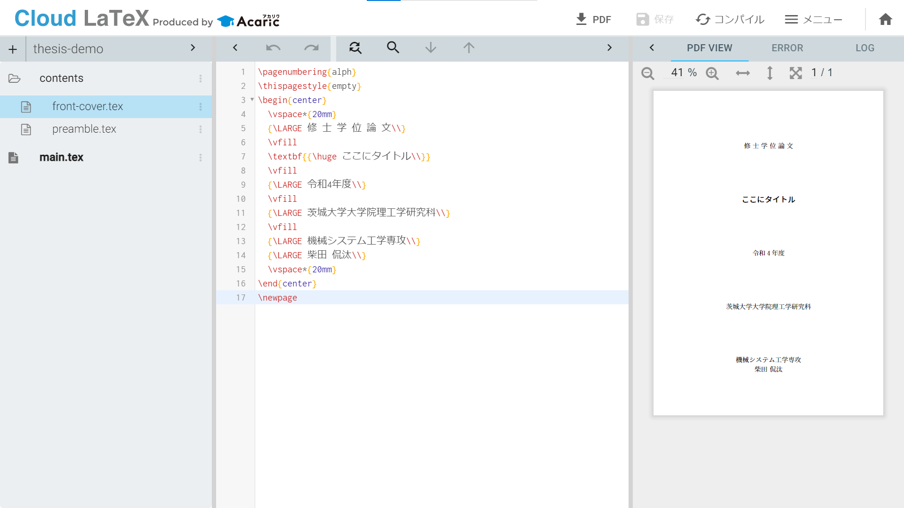

# 表紙を作る
まずは，表紙から作っていきます．表紙に載せる項目は要項に従います．ファイルの構成と最終的な仕上がりは下の画像のようになります．

表紙に載せる情報は`front-cover.tex`に書き込みます．その後，`front-cover.tex`を`main.tex`で読み込みます．
````{grid-item-card}
`front-cover.tex`
^^^^^^^^^
```latex
\pagenumbering{alph}
\thispagestyle{empty}
\begin{center}
  \vspace*{20mm}
  {\LARGE 修 士 学 位 論 文\\}
  \vfill
  \textbf{{\huge ここにタイトル\\}}
  \vfill
  {\LARGE 令和4年度\\}
  \vfill
  {\LARGE 茨城大学大学院理工学研究科\\}
  \vfill
  {\LARGE 機械システム工学専攻\\}
  {\LARGE 柴田 侃汰\\}
  \vspace*{20mm}
\end{center}
\newpage
```
````

````{grid-item-card}
`main.tex`
^^^^^^^^^^^^^
```latex
\RequirePackage{plautopatch}
\RequirePackage[l2tabu, orthodox]{nag}

\documentclass[]{jlreq}

\input{contents/preamble.tex}

\begin{document}
\input{contents/front-cover.tex}  % タイトル情報
\end{document}
```
````